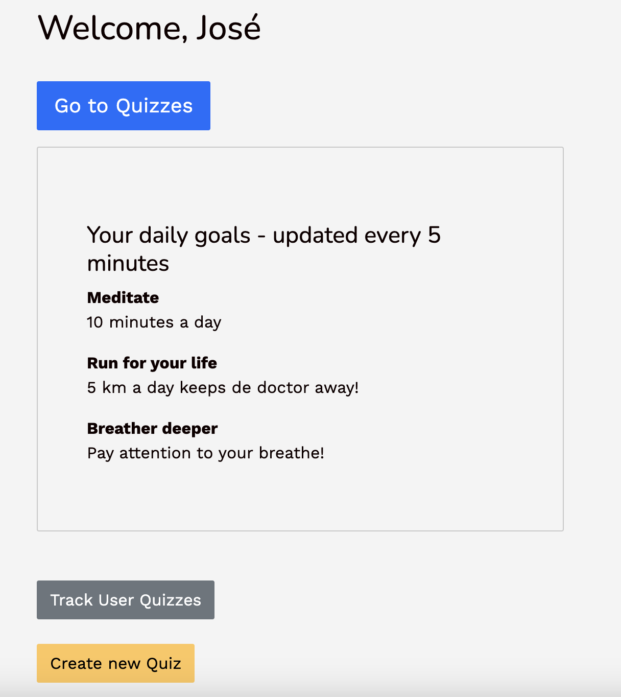
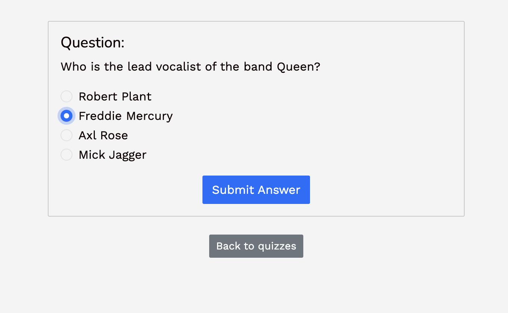
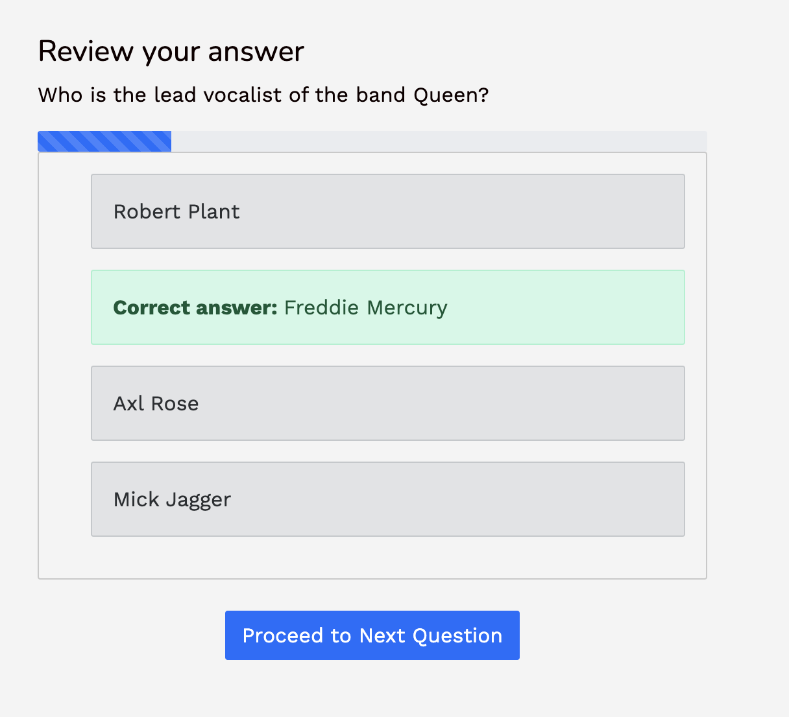
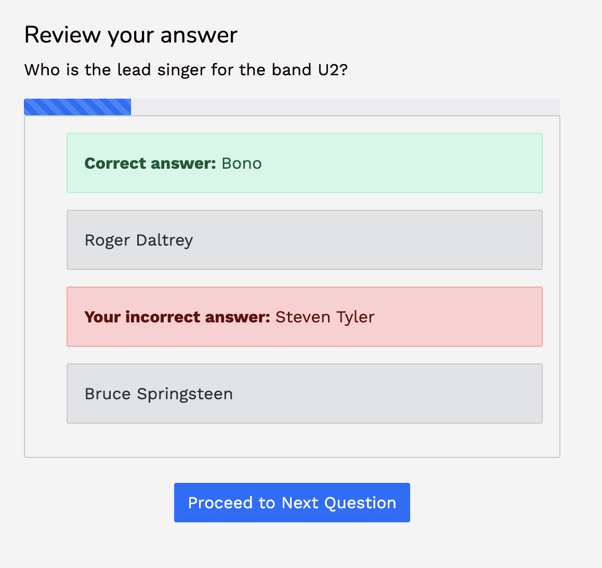

# Psyquiz

Psyquiz is a dynamic and intuitive app designed to enable admins to set quizzes for users. It provides instant feedback to users about the correctness of their answers, and dynamically updates goals every 5 minutes.




## Features

- **User Features**:
  - Take quizzes set by the admin.
  - Receive immediate feedback upon answering each quiz question.
  - View dynamically updated goals that refresh every 5 minutes.

- **Admin Features**:
  - Create, update, and delete quizzes and goals.
  - Track the performance of users through analytics.

  
  
  

## Installation & Setup

1. Clone the repository:
    ```bash
    git clone https://github.com/your-username/Psyquiz.git
    ```

2. Navigate into the directory:
    ```bash
    cd Psyquiz
    ```

3. Install the required dependencies
    ```bash
    bundle install
    ```

3. Run migration and seed
    ```bash
    rails db:migrate db:seed
    ```


4. Start the application:
    ```bash
    rails s
    webpack build --watch
    ```
